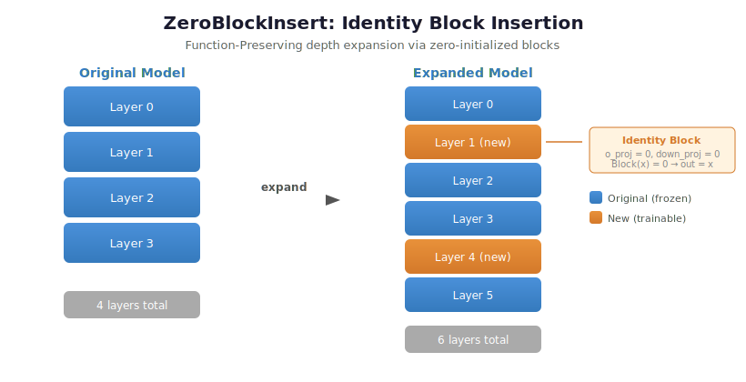
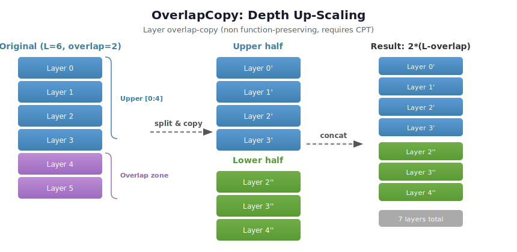
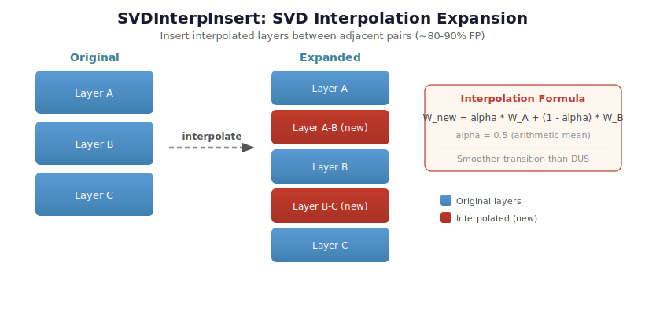
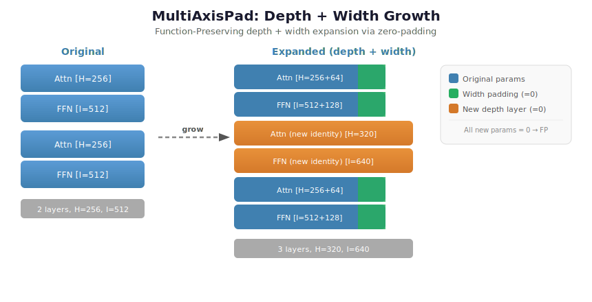
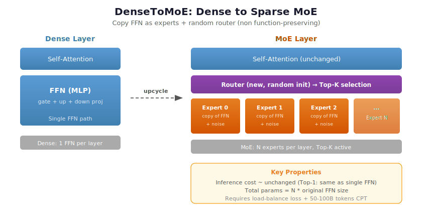
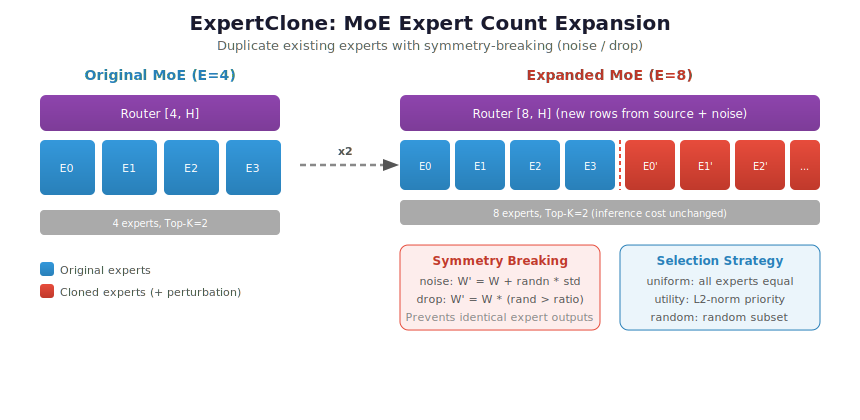

# llm-grow

<p align="center">
  
</p>

<p align="center">
  <em>Expand Existing Models, Layer by Layer</em>
</p>

<p align="center">
  <a href="#安装">安装</a> &bull;
  <a href="#快速开始">快速开始</a> &bull;
  <a href="#扩增方法总览">方法总览</a> &bull;
  <a href="#api-参考">API 参考</a> &bull;
  <a href="#扩增教程">教程</a> &bull;
  <a href="README.md">English</a>
</p>

<p align="center">
  
</p>

---

从已有 LLM checkpoint **生长**出更大模型的模块化工具库。

**核心特性**：

- **两层扩增体系** — 内存级（`nn.Module` 原地修改）和 Safetensor 级（mmap 流式，峰值内存 ≤ 4 GB）
- **四类架构全覆盖** — Dense / MoE-Standard / DeepSeek-MoE / LongCat，自动检测自动选择
- **六种扩增算法** — ZeroBlockInsert、OverlapCopy、SVDInterpInsert、MultiAxisPad、DenseToMoE、ExpertClone
- **Function-Preserving** — ZeroBlockInsert / MultiAxisPad 扩增后 zero-shot 精度零损失
- **完整训练工具链** — 冻结训练、知识蒸馏、渐进式掩码生长、MoE 负载均衡

---

## 目录

- [安装](#安装)
- [快速开始](#快速开始)
- [扩增方法总览](#扩增方法总览)
- [方法选择指南](#方法选择指南)
- [API 参考](#api-参考)
- [训练与评估](#训练与评估)
- [扩增教程](#扩增教程)
- [实测结果](#实测结果)
- [项目结构](#项目结构)
- [参考文献](#参考文献)

---

## 安装

```bash
pip install -e .                # 基础（扩增 + CLI）
pip install -e ".[train]"       # + 训练依赖（DeepSpeed, Flash-Attn, Datasets）
pip install -e ".[eval]"        # + 评估依赖（lm-eval-harness）
pip install -e ".[dev]"         # + 开发环境（pytest, ruff, mypy）
```

**环境要求**：Python >= 3.10, PyTorch >= 2.2, Transformers >= 4.40, safetensors >= 0.4

---

## 快速开始

### CLI（推荐）

安装后提供 `llm-grow` 命令：

```bash
# 深度扩增（自动检测 Dense / MoE）
llm-grow expand --src /path/to/model --dst ./output \
    --method depth --num-new-layers 4

# MoE 专家扩增
llm-grow expand --src /path/to/moe_model --dst ./output \
    --method expert --expand-factor 2

# FFN 宽度扩增
llm-grow expand --src /path/to/model --dst ./output \
    --method width --ffn-size-expansion 512

# Dry-run 确认方案（不写文件）
llm-grow expand --src /path/to/model --dst /tmp/out \
    --method depth --dry-run

# 验证扩增结果（结构 + FP 一致性）
llm-grow verify --src /path/to/original --dst /path/to/expanded --fp

# 查看模型架构信息
llm-grow info --src /path/to/model
```

### Python API

```python
# Safetensor 扩增（适合大模型，不加载权重）
from llm_grow.safetensor.auto import auto_expand

auto_expand(
    src_dir="/path/to/model",
    dst_dir="./expanded",
    method="depth",             # "depth" | "expert" | "width"
    num_new_layers=4,
)

# 内存级扩增（适合小模型 / 快速实验）
import copy
from transformers import AutoModelForCausalLM
from llm_grow.expanders.depth.zero_block_insert import (
    ZeroBlockInsertConfig, ZeroBlockInsertExpander,
)

model = AutoModelForCausalLM.from_pretrained("Qwen/Qwen3-8B", torch_dtype="auto")
original = copy.deepcopy(model)
expanded = ZeroBlockInsertExpander().expand(
    model,
    ZeroBlockInsertConfig(num_new_layers=9, freeze_original=True),
)
ZeroBlockInsertExpander().verify(original, expanded)
```

---

## 扩增方法总览

### 方法对比

| 方法 | FP | 扩展方向 | 即时精度 | 推荐 CPT | 推理延迟 |
|------|:---:|:---:|:---:|:---:|:---:|
| **ZeroBlockInsert** | yes | 深度 | **100%** | 8-16B tokens | +线性 |
| **OverlapCopy** | no | 深度 | 50-80% | 100B+ tokens | +线性 |
| **SVDInterpInsert** | ~yes | 深度 | 80-90% | <50B tokens | +线性 |
| **MultiAxisPad** | yes | 深度+宽度 | **100%** | 30-60B tokens | ~1.4x |
| **DenseToMoE** | no | Dense->MoE | 70-85% | 50-100B tokens | ~不变 |
| **ExpertClone** | ~yes | MoE 专家 | -- | 节省 32-67% | ~不变 |

> **FP** = Function-Preserving：扩增后输出与原始模型完全一致（zero-shot 精度零损失）。

### 原理图

#### ZeroBlockInsert — 恒等块嫁接

在均匀间隔处插入 identity block（`o_proj` / `down_proj` 置零），残差连接保证 `output = x + 0 = x`。

<p align="center"></p>

#### OverlapCopy — 层重叠拼接

将原模型分为 upper / lower 两段（重叠区保证平滑），拼接后层数倍增。非 FP，需大量 CPT。

<p align="center"></p>

#### SVDInterpInsert — SVD 插值嫁接

对相邻层权重做算术平均插值，新层从有意义的初始化出发，收敛速度优于 DUS。

<p align="center"></p>

#### MultiAxisPad — 多维掩码生长

同时扩增深度（identity block）和宽度（零填充 hidden / FFN 维度），所有新参数初始化为零，严格 FP。

<p align="center"></p>

#### DenseToMoE — Dense 转稀疏 MoE

将 Dense FFN 复制为 N 个专家 + 随机初始化 Router。Top-K 路由使推理成本近似不变。

<p align="center"></p>

#### ExpertClone — MoE 专家克隆

复制已有专家并施加对称性破坏（noise / drop），Router 权重对应扩展。推理成本不变。

<p align="center"></p>

---

## 方法选择指南

```
需要扩增参数量
|
+-- 超大模型（无法完整加载）--> Safetensor 直接扩增
|   +-- Dense 模型
|   |   +-- 深度扩增        llm-grow expand --method depth
|   |   +-- FFN 宽度扩增    llm-grow expand --method width
|   +-- MoE 模型
|       +-- 专家扩增（推理成本不变）  llm-grow expand --method expert
|       +-- 深度扩增（层数增加）      llm-grow expand --method depth
|
+-- 中小模型（可加载进内存）--> 内存级扩增
    +-- 精度最优先，数据有限   --> ZeroBlockInsert（FP, 8-16B tokens）
    +-- 精确 2x，控制延迟     --> MultiAxisPad（深度+宽度, ~1.4x 延迟）
    +-- 最简实现，数据充足     --> OverlapCopy
    +-- 推理延迟不能增加       --> DenseToMoE（top-1 激活量不变）
    +-- 基座已是 MoE           --> ExpertClone
```

---

## API 参考

### 两层扩增体系

| | 内存级 (`expanders/`) | Safetensor 级 (`safetensor/`) |
|---|---|---|
| **输入** | `nn.Module` | `.safetensors` 目录 |
| **输出** | `nn.Module` | `.safetensors` 目录 |
| **内存峰值** | 完整模型 | ≤ 1 个输出 shard (~4 GB) |
| **FP 验证** | 直接对比 logits | 结构检查 + 可选 logit 对比 |
| **适用场景** | 小模型 / 快速实验 | 100B+ 超大模型 |

### Safetensor 扩增

#### 自动检测架构

`detect_model()` 从 `config.json` + 权重索引推断架构，无需加载权重：

```python
from llm_grow.safetensor.detect import detect_model

profile = detect_model("/path/to/model")
print(profile.family)   # "dense" | "standard_moe" | "deepseek_moe" | "longcat"
```

| 检测结果 | 代表模型 | 关键特征 |
|---------|---------|---------|
| `dense` | Qwen3-0.6B/8B/14B/32B | 无 `mlp.experts.*` |
| `standard_moe` | Qwen3-30B-A3B | `mlp.experts.*` + `mlp.gate.weight` |
| `deepseek_moe` | Kimi-K2-Base | MLA + fp8 + 共享专家 + dense 首层 |
| `longcat` | LongCat-Flash-Chat | 双路注意力 + 双 MLP + 512 专家 |

#### auto_expand()

```python
from llm_grow.safetensor.auto import auto_expand

auto_expand(
    src_dir="/path/to/model",
    dst_dir="./expanded",
    method="depth",               # "depth" | "expert" | "width"
    num_new_layers=4,             # [depth] 新增层数
    insert_strategy="uniform",    # [depth] "uniform" | "front" | "rear"
    expand_factor=2,              # [expert] 专家倍数
    ffn_size_expansion=0,         # [width] intermediate_size 增量
    target_shard_gb=4.0,          # 输出 shard 大小
    dry_run=False,                # True = 只打印方案不写文件
)
```

#### 预配置工厂函数

| 函数 | 适用模型 | 说明 |
|------|---------|------|
| `make_qwen3moe_expert_clone(factor)` | Qwen3-30B-A3B | 专家数扩增 |
| `make_qwen3moe_zero_block_insert(n)` | Qwen3-30B-A3B | 深度扩增 |
| `make_kimik2_expert_clone(factor)` | Kimi-K2-Base | 专家数扩增（含 fp8 处理） |
| `make_kimik2_zero_block_insert(n)` | Kimi-K2-Base | 深度扩增（含 dense 首层处理） |

#### ExpansionPlan 序列化

```python
plan.save_json("my_plan.json")
plan = ExpansionPlan.load_json("my_plan.json")
```

#### MoE 宽度扩增（M3/M4）

```python
from llm_grow.safetensor.models.moe_width import MoEWidthConfig, MoEWidthExpander

# M3: 扩增专家 FFN 宽度
MoEWidthExpander(MoEWidthConfig(ffn_size_expansion=1024)).expand(
    src_dir="/path/to/moe_model", dst_dir="./moe_wider",
)

# M4: 扩增 hidden_size
MoEWidthExpander(MoEWidthConfig(hidden_size_expansion=256)).expand(
    src_dir="/path/to/moe_model", dst_dir="./moe_wider_hidden",
)
```

### 内存级扩增

#### ZeroBlockInsert

```python
from llm_grow.expanders.depth.zero_block_insert import (
    ZeroBlockInsertConfig, ZeroBlockInsertExpander,
)

expanded = ZeroBlockInsertExpander().expand(model, ZeroBlockInsertConfig(
    num_new_layers=9,           # 建议 = 原层数 // 4
    insert_strategy="uniform",  # "uniform" | "front" | "rear"
    freeze_original=True,       # Phase-1 仅训练新块
))
```

#### MultiAxisPad

```python
from llm_grow.expanders.width.multi_axis_pad import (
    MultiAxisPadConfig, MultiAxisPadExpander,
)

expanded = MultiAxisPadExpander().expand(model, MultiAxisPadConfig(
    num_new_layers=10,
    hidden_size_expansion=512,
    intermediate_size_expansion=3072,
    freeze_original=True,
))
```

#### DenseToMoE

```python
from llm_grow.expanders.sparse.dense_to_moe import DenseToMoEConfig, DenseToMoEExpander

expanded = DenseToMoEExpander().expand(
    model, DenseToMoEConfig(num_experts=8, top_k=2),
)
```

#### ExpertClone

```python
from llm_grow.expanders.sparse.expert_clone import (
    ExpertCloneConfig, ExpertCloneExpander, ExpertSelectionStrategy,
)

expanded = ExpertCloneExpander().expand(
    moe_model,
    ExpertCloneConfig(
        expand_factor=2,
        selection_strategy=ExpertSelectionStrategy.UTILITY,
    ),
)
```

#### SVDInterpInsert

```python
from llm_grow.expanders.depth.svd_interp_insert import (
    SVDInterpInsertConfig, SVDInterpInsertExpander,
)

expanded = SVDInterpInsertExpander().expand(
    model, SVDInterpInsertConfig(use_predictor=False),
)
```

---

## 训练与评估

### 两阶段冻结训练

```python
from llm_grow.training.freeze import (
    snapshot_param_ids, mark_new_params,
    freeze_original_layers, unfreeze_all,
)

original_ids = snapshot_param_ids(model)
expander.expand(model, config)
mark_new_params(model, original_ids)

freeze_original_layers(model)          # Phase-1: 仅训练新增参数
train(model, phase1_data, lr=2e-4)

unfreeze_all(model)                    # Phase-2: 全量微调
train(model, phase2_data, lr=1e-5)
```

### 知识蒸馏

```python
from llm_grow.training.distillation import (
    DistillConfig, DistillationLoss, run_teacher_inference,
)

criterion = DistillationLoss(DistillConfig(temperature=2.0, alpha=0.5))
teacher_logits = run_teacher_inference(teacher, input_ids)
loss = criterion(student_logits, teacher_logits, labels=labels)
```

### MoE 负载均衡

```python
from llm_grow.training.load_balance import combined_moe_loss

loss = combined_moe_loss(
    lm_loss, router_logits_list,
    num_experts=8, top_k=2,
    balance_coeff=1e-2, z_coeff=1e-3,
)
```

### 渐进式掩码生长（MSG）

```python
from llm_grow.training.growth_scheduler import GrowthScheduleConfig, GrowthScheduler

scheduler = GrowthScheduler(GrowthScheduleConfig(
    total_steps=100_000, warmup_ratio=0.3, strategy="linear",
))

ratio = scheduler.get_unlock_ratio(step)
scheduler.apply_masks(model, ratio)
```

### Function-Preserving 验证

```python
from llm_grow.eval import verify_fp, StructuralVerifier

verify_fp("path/to/original", "path/to/expanded", atol=1e-4)

verifier = StructuralVerifier(src_dir="/path/to/original", dst_dir="/path/to/expanded")
results = verifier.run_all()
```

### 精度恢复曲线追踪

```python
from llm_grow.eval import RecoveryCurveTracker

tracker = RecoveryCurveTracker("recovery.jsonl")
tracker.set_baseline({"mmlu": 0.72, "gsm8k": 0.65})
tracker.log(step=1000, tokens_seen=2e9, scores=run_eval(model))
tracker.summary()
```

---

## 扩增教程

| 模型 | 架构 | 参数量 | 教程 |
|------|:---:|:---:|------|
| Qwen3-0.6B | Dense | 596M | [docs/expand_qwen3_0.6b.md](docs/expand_qwen3_0.6b.md) |
| Qwen3-30B-A3B | MoE Standard | ~30B | [docs/expand_qwen3_30b_a3b.md](docs/expand_qwen3_30b_a3b.md) |
| Kimi-K2-Base | DeepSeek MoE | ~1T | [docs/expand_kimi_k2.md](docs/expand_kimi_k2.md) |
| LongCat-Flash-Chat | LongCat MoE | ~0.5T | [docs/expand_longcat_flash.md](docs/expand_longcat_flash.md) |

---

## 实测结果

### 内存级扩增（Qwen3-0.6B, 596M, 28 层, CPU）

| 方法 | 层数 | 参数量 | 倍率 | FP 验证 | 耗时 |
|------|:---:|:---:|:---:|:---:|:---:|
| ZeroBlockInsert (+7) | 28->35 | 596M->706M | 1.19x | max\|d\|=**0.000** | 0.2s |
| OverlapCopy (overlap=8) | 28->40 | 596M->785M | 1.32x | 非FP（预期） | 0.2s |
| SVDInterpInsert (+4) | 28->32 | 596M->659M | 1.11x | 近似FP | 0.05s |
| MultiAxisPad (+4) | 28->32 | 596M->659M | 1.11x | max\|d\|=**0.000** | 0.05s |
| DenseToMoE (x4) | 28->MoE | 596M->1.39B | 2.33x | 非FP（预期） | 6.1s |
| ExpertClone (4->8) | -- | 1.39B->2.45B | 1.76x | 对称破坏后通过 | 1.7s |

### Safetensor 扩增（dry-run 验证）

| 模型 | 方法 | 原始张量 | 输出张量 | 新增 |
|------|------|:---:|:---:|:---:|
| Qwen3-0.6B | depth +4 层 | 311 | 355 | 44 |
| Qwen3-0.6B | ZeroBlockInsert +7 | 311 | 388 | 77 |
| Qwen3-30B-A3B | expert 128->256 | 18,867 | 37,299 | 18,432 |
| Qwen3-30B-A3B | depth 48->56 | 18,867 | 22,011 | 3,144 |
| Kimi-K2-Base | expert 384->768 | 139,644 | 277,884 | 138,240 |
| Kimi-K2-Base | depth 61->65 | 139,644 | 148,952 | 9,308 |

---

## 项目结构

```
llm-grow/
+-- src/llm_grow/
|   +-- cli.py                  # CLI 入口
|   +-- safetensor/             # Safetensor 级扩增（mmap 流式）
|   |   +-- auto.py             #   auto_expand() 统一入口
|   |   +-- detect.py           #   ModelProfile 架构自动检测
|   |   +-- base.py             #   ExpansionPlan + 两阶段写出
|   |   +-- methods/            #   按扩增方法组织
|   |   +-- models/             #   按模型架构组织
|   +-- expanders/              # 内存级扩增
|   |   +-- depth/              #   ZeroBlockInsert / OverlapCopy / SVDInterpInsert
|   |   +-- width/              #   MultiAxisPad
|   |   +-- sparse/             #   DenseToMoE / ExpertClone
|   +-- initializers/           # 权重初始化
|   +-- training/               # 冻结 / 蒸馏 / 调度 / 负载均衡
|   +-- eval/                   # FP 验证 / 结构验证 / 恢复曲线
+-- examples/                   # 示例脚本
+-- tests/                      # 单元测试
+-- docs/                       # 教程 + 架构图
```

---

## 参考文献

1. **LLaMA-Pro** — Wu et al., [arXiv:2401.02415](https://arxiv.org/abs/2401.02415) (2024)
2. **SOLAR DUS** — Kim et al., [arXiv:2312.15166](https://arxiv.org/abs/2312.15166) (2023)
3. **LESA** — Yang et al., [arXiv:2502.13794](https://arxiv.org/abs/2502.13794) (2025)
4. **MSG** — Du et al., [arXiv:2305.02869](https://arxiv.org/abs/2305.02869) (2023)
5. **Net2Net** — Chen et al., [arXiv:1511.05641](https://arxiv.org/abs/1511.05641) (ICLR 2016)
6. **Sparse Upcycling** — Komatsuzaki et al., [arXiv:2212.05055](https://arxiv.org/abs/2212.05055) (ICLR 2023)
7. **ExpertClone** — Amazon AI, [arXiv:2604.19835](https://arxiv.org/abs/2604.19835) (2026)
8. **DeepSeek-V2 MLA** — DeepSeek AI, [arXiv:2405.04434](https://arxiv.org/abs/2405.04434) (2024)
